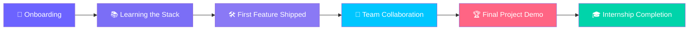

<!-- Animated wave banner -->

<!-- Typing animation tagline -->

 

<!-- Badges -->

---

## 👋 About Me

> Aspiring **Software Developer** who interned at **DevRise**, working on real-world products, collaborating with a cross-functional team, and shipping features end-to-end.
<!-- 

  

 -->

- 🎓 **Role:** Software Development Intern
- 🏢 **Company:** DevRise
- 📅 **Duration:** 1 July 2026 - 26 Aug 2026 
- 📍 **Location:** Virtual
- 🤝 **Team:** Engineering 

---

## 🧭 Internship Journey

---

## 🛠️ Tech Stack I Worked With

---

## 🚀 Projects & Contributions

<table align="center">
<tr>
<th>Project</th>
<th>Description</th>
<th>Tech</th>
<th>Link</th>
</tr>
<tr><tr>
    <td><b>🌐 Landing Page</b></td>
    <td>Designed and developed a fully responsive and modern landing page with optimized performance, intuitive UI, and cross-browser compatibility to enhance user engagement.</td>
    <td>HTML, CSS, JavaScript</td>
    <td><a href="https://dev-rise.vercel.app/">Demo</a></td>
</tr>

<tr>
    <td><b>🌦️ Weather Dashboard</b></td>
    <td>Built a real-time weather dashboard that fetches live weather data through APIs, displaying current conditions, forecasts, and location-based weather with an interactive interface.</td>
    <td>HTML,CSS,JS OpenWeather API</td>
    <td><a href="https://dev-rise-2fva.vercel.app/">Demo</a></td>
</tr>

<tr>
    <td><b>👨‍💻 Portfolio Website</b></td>
    <td>Developed a responsive personal portfolio showcasing projects, technical skills, experience, and contact information with smooth animations and optimized performance.</td>
    <td>React,mongodb,expressjs,nodejs, JavaScript</td>
    <td><a href="https://devrisetask3.vercel.app/">Demo</a></td>
</tr>
</table>

---

## 📈 What I Learned

| 💡 Skill | 📌 Description |
|---|---|
| **Agile Workflow** | Sprint planning, standups, and retrospectives with a real team |
| **Code Reviews** | Writing clean, reviewable code and giving/receiving feedback |
| **Version Control** | Branching strategies, PRs, and resolving merge conflicts |
| **Communication** | Presenting progress to mentors and stakeholders |
| **Problem Solving** | Debugging production-level issues under real constraints |

---

## 🏆 Achievements

- ✅ Shipped **3+ features** to production
- ✅ Received **certificate of completion** from DevRise
- ✅ Recognized for [specific contribution]

  

---

## 📜 Certificate

  
   
  <!-- Replace this with a screenshot of your actual certificate -->

---

## 🤝 Connect With Me

  

---

**Thank you, DevRise, for this opportunity! 🚀**

